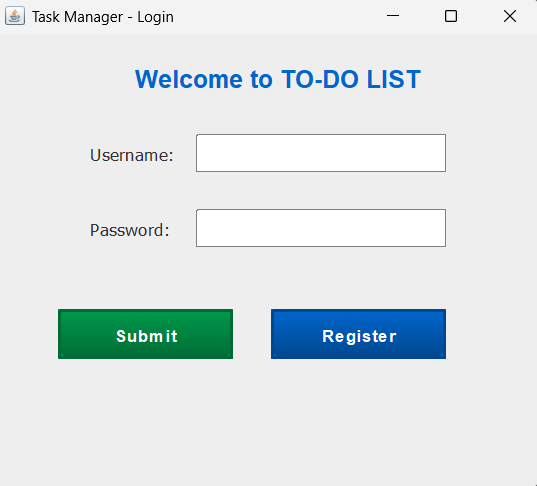
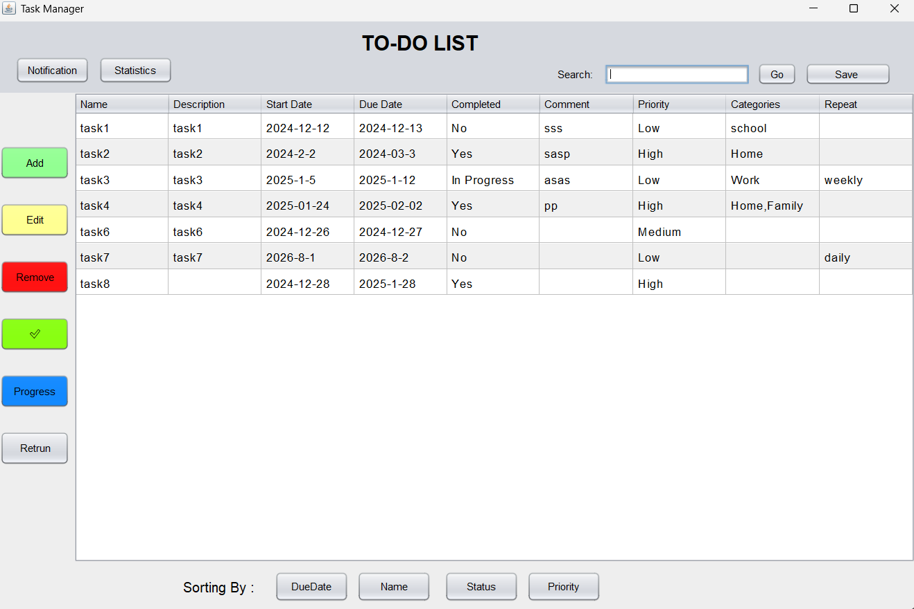
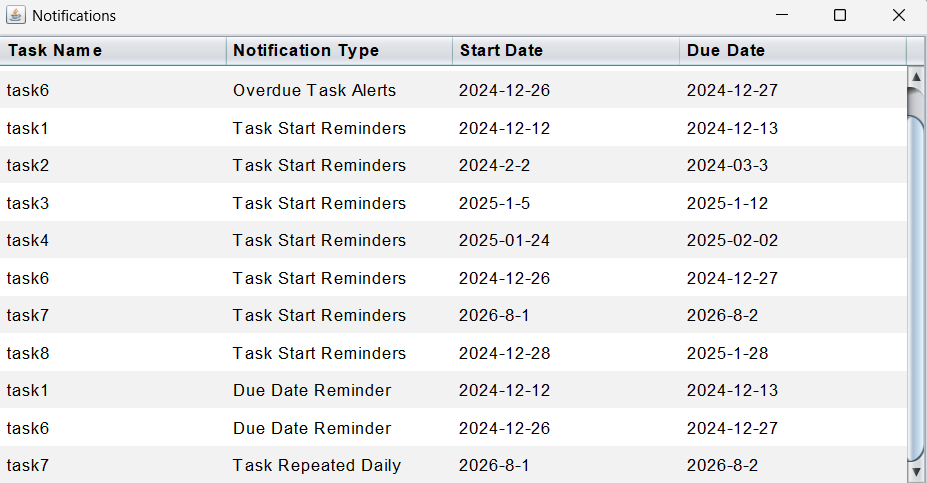
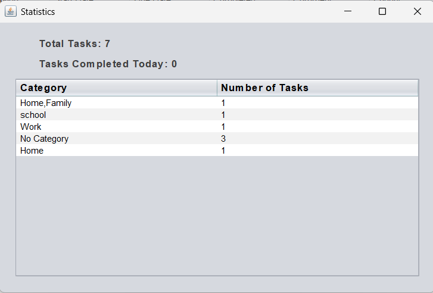
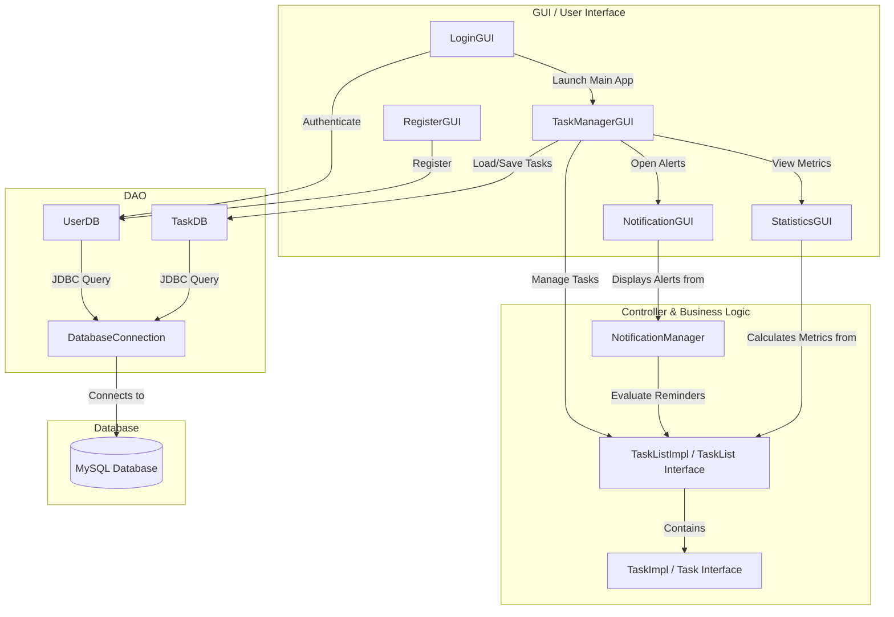

# Task Manager (TO-DO LIST)

A robust, full-featured desktop Task Management application built with **Java (Swing GUI)** and **MySQL** database persistence. Featuring multi-user authentication, comprehensive task lifecycle tracking, intelligent notifications, and data analytics.

---

## 📸 Application Figures & Visual Tour

Here is a visual overview of the Task Manager user interface and features:

### 1. User Authentication (`Login.png`)
The gateway to the application provides secure user login and navigation to account registration.


### 2. Main Dashboard & Task Management (`Main_page.png`)
The primary workspace displaying all tasks in a structured tabular view with quick actions for creating, editing, deleting, searching, filtering, and persisting tasks.


### 3. Notification & Alert Center (`Notifications.png`)
Automated alerts for task due dates, overdue items, daily/weekly/monthly recurring reminders, and task start notifications.


### 4. Task Statistics & Performance Analytics (`statistics.png`)
Visual insights and metrics summarizing completed vs. pending tasks, category distributions, and task completion metrics.


---

## ✨ Key Features

- **🔒 Secure Authentication & Multi-User Support**
  - Registration and login system using JDBC and MySQL persistence.
  - User session isolation guaranteeing each user sees only their assigned tasks.

- **📋 Complete Task Lifecycle (CRUD)**
  - Create, view, update, and delete tasks.
  - Custom attributes: Name, Description, Start Date, Due Date, Completion Status (`Yes` / `No` / `In Progress`), Priority (`High`, `Medium`, `Low`), Category (`Work`, `Personal`, `Study`, etc.), Recurrence (`daily`, `weekly`, `monthly`), and custom Comments.

- **🔍 Real-Time Search & Data Persistence**
  - Instantly search tasks by keyword.
  - Manual & prompt-on-exit auto-save capability ensuring database synchronization before application shutdown.

- **🔔 Automated Notification Engine**
  - **Due Date Reminders**: Notifications for tasks approaching their due date.
  - **Overdue Task Alerts**: Flags tasks that missed their completion deadline.
  - **Task Start Reminders**: Alerts when scheduled task start dates arrive.
  - **Recurring Task Notifications**: Automatic reminders for daily, weekly, and monthly tasks.
  - **Weekly Summary**: Forward-looking view of tasks coming up in the next 7 days.

- **📊 Statistics & Data Visualization**
  - Progress metrics summarizing completed, in-progress, and overdue task ratios.

---

## 🏗️ System Architecture & Design Patterns

The project follows clean object-oriented architecture and the **Model-View-Controller (MVC)** and **Data Access Object (DAO)** software design patterns:



### Key Modules:
- **`DatabaseConnection.java`**: Manages MySQL JDBC connection lifecycle.
- **`UserDB.java`**: Handles user authentication, validation, and ID lookup.
- **`TaskDB.java`**: DAO for inserting, updating, fetching, and deleting user tasks.
- **`Task.java` / `TaskImpl.java`**: Domain model encapsulating task attributes and completion states.
- **`TaskList.java` / `TaskListImpl.java`**: Collection manager providing search, filtering, and sorting capabilities.
- **`Notification.java` / `NotificationManager.java`**: Rules engine for checking date thresholds and building alert streams.
- **`LoginGUI.java`, `RegisterGUI.java`, `TaskManagerGUI.java`, `NotificationGUI.java`, `StatisticsGUI.java`**: Swing-based UI frames and custom rendered components.

---

## 🗄️ Database Setup

Create the MySQL database and requisite tables before launching the application:

```sql
CREATE DATABASE IF NOT EXISTS task_manager;
USE task_manager;

-- User Table
CREATE TABLE IF NOT EXISTS user (
    id INT AUTO_INCREMENT PRIMARY KEY,
    username VARCHAR(50) NOT NULL UNIQUE,
    password VARCHAR(100) NOT NULL
);

-- Task Table
CREATE TABLE IF NOT EXISTS task (
    id INT AUTO_INCREMENT PRIMARY KEY,
    user_id INT NOT NULL,
    name VARCHAR(100) NOT NULL,
    description TEXT,
    start_date VARCHAR(20),
    due_date VARCHAR(20),
    completed VARCHAR(20) DEFAULT 'No',
    priority VARCHAR(20),
    category VARCHAR(50),
    compelete_date VARCHAR(20),
    repeated VARCHAR(20),
    comment TEXT,
    FOREIGN KEY (user_id) REFERENCES user(id) ON DELETE CASCADE
);
```

### Database Configuration
Update connection settings in [`DatabaseConnection.java`](src/taskManager/DatabaseConnection.java):
```java
private static final String URL = "jdbc:mysql://localhost:3306/task_manager";
private static final String USERNAME = "root";
private static final String PASSWORD = "your_mysql_password";
```

---

## 🛠️ Prerequisites & Installation

### Requirements
- **Java Development Kit (JDK)**: Version 8 or higher (JDK 11+ recommended).
- **MySQL Server**: Version 5.7 or 8.0+.
- **MySQL Connector/J**: JDBC Driver jar (included in classpath or standard library).

### Building & Running from Command Line

1. **Clone or Download the Repository**:
   ```bash
   git clone https://github.com/your-username/TaskManager.git
   cd TaskManager
   ```

2. **Compile the Application**:
   ```bash
   javac -d bin src/taskManager/*.java
   ```

3. **Run the Application**:
   ```bash
   java -cp "bin;lib/mysql-connector-j.jar" taskManager.LoginGUI
   ```

*(Note: Adjust the classpath delimiter to `:` on Linux/macOS systems).*

---

## 📁 Repository Structure

```
TaskManager/
├── Login.png               # Screenshot: Login Window
├── Main_page.png            # Screenshot: Main Task Dashboard
├── Notifications.png        # Screenshot: Notification Alerts Window
├── statistics.png           # Screenshot: Statistics & Metrics Window
├── diagram class.ucls       # UML Class Diagram (UCL Format)
├── src/
│   └── taskManager/
│       ├── DatabaseConnection.java   # MySQL Database Connection Helper
│       ├── LoginGUI.java             # Login Window & Entry Point
│       ├── Notification.java          # Notification Data Model
│       ├── NotificationGUI.java       # Notifications Window
│       ├── NotificationManager.java   # Notification Rules Engine
│       ├── RegisterGUI.java           # User Registration Window
│       ├── StatisticsGUI.java         # Task Metrics & Statistics Window
│       ├── Task.java                  # Task Interface
│       ├── TaskDB.java                # Task Data Access Object (DAO)
│       ├── TaskImpl.java              # Task Implementation Model
│       ├── TaskList.java              # Task List Interface
│       ├── TaskListImpl.java          # Task List Business Logic
│       ├── TaskManagerGUI.java        # Main Dashboard GUI Frame
│       └── UserDB.java                # User Data Access Object (DAO)
└── README.md                          # Project Documentation
```

---

## 🤝 License & Author Information

Developed as a Java Desktop Application showcasing GUI development, JDBC database integration, design patterns (MVC/DAO), and task management functionality.
